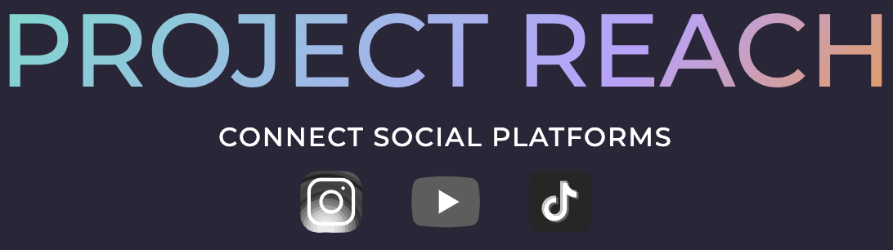

[Brickhack](https://brickhack.io/) webapp to post a video to a bunch of platforms at the same time

 

Check out the website @ [https://ProjectReach.biz](https://ProjectReach.biz)

## Inspiration
Making and distributing educational videos can be made simpler with the the right tools!

This project was hoping to enter into coolest domain name, best educational app, and prettiest UI

## What it does
By making one interface to post videos to many platforms, we can save time, increase consistency, and avoid mistakes

## How we built it
For a website we need a domain (Kindly provided by our sponsors), a computer (to run the a server), and some software to build it: nodejs for hosting, vue for the frontend app. Finally we pulled in some api's like the googoleapi's to connect accounts from youtube 

## Challenges we ran into
The major league platforms don't hand out free and unlimited access with ease. Many (like Tik Tok), block it behind some form of app review team. Youtube gives developer access with some restrictions, and the api docs are are over the place. Finding the most recent api was very difficult. We also ran out of our free developer api quota after posting 8 videos, and spamming google auth countless time

## Accomplishments that we're proud of
In the end we were able to make a pretty UI, and integrate youtube into our app (only private uploads before app review)

## What we learned
OAuth, one way to implement server side sessions by hand, how the top platforms share their api's

## What's next for Project Reach
It would be great to integrate Project Reach with Instagram and TIk Tok, it just might take a little over 24 hours

## Thank you
Thank you so much for your support!

