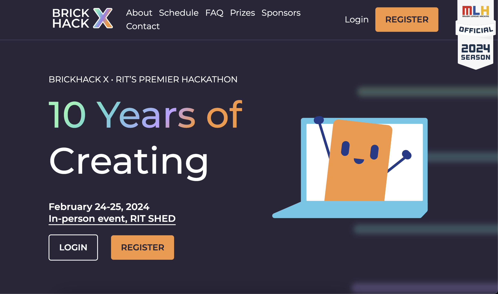

# Project Reach
A [Brickhack](https://brickhack.io/) webapp to post a video to a bunch of platforms at the same time

<a href="https://www.youtube.com/watch?v=U8V4j2Ws6_U" to="_blank">

</a>

Check out the [slides](Brick-Hack-Presentation.pdf)  
Check out the project on [devpost](https://devpost.com/software/project-reach-uv3fjo)  
Check out the website @ [https://ProjectReach.biz](https://ProjectReach.biz)


## Inspiration
Making and distributing educational videos can be made simpler with the the right tools!  

This project was hoping to enter into coolest domain name, best educational app, and prettiest UI 

Another goal was to match the look and feel of brick hack in an effort to earn more points with the judges

<table width=100%>
  <tr>
    <th></th>
    <th></th>
  </tr>
  <tr>
    <td width=50% align=center>
    Brick Hack Homepage</td>
    <td width=50% align=center>Project Reach Hompage</td>
  </tr>
  <tr>
</table>


## What it does
By making one interface to post videos to many platforms, we can save time, increase consistency, and avoid mistakes

## How we built it
For a website we needed a domain (Kindly provided by our sponsors), a computer (to run the a server), and some software to build it: nodejs for hosting, vue for the frontend app. We used certbot to get some ssl certifactes. Finally we pulled in some api's like the googoleapi's to connect accounts from youtube 
```bash
# First gather developer access credentials, see MORE.md, then swap mine out in (they're access is turned off)
# backend/appConfig2.json is the current file, consider changing the index of the redirect_url depending on production vs dev
cd view    && npm run install && npm run build    # Build the app 
cd ../backend && npm run install && node index.js # Serve the app
```

## Challenges we ran into
The major league platforms don't hand out free and unlimited uppload access with ease. Many (like Tik Tok), block the feature behind some form of app review team. Youtube gives developer access with some restrictions, and the api docs are all over the place. Finding the most recent version of the youtube api was difficult. We also ran out of our free developer api quota after posting 8 videos, and spamming google auth countless times

## Accomplishments that we're proud of
In the end we were able to make a pretty UI, and integrate youtube uploads into our app (only private uploads before app review)

## What we learned
OAuth, one way to implement server side sessions by hand, how the top platforms share their api's

## What's next for Project Reach
It would be great to integrate Project Reach with Instagram and TIk Tok, it just might take a little over 24 hours

## Thank you
Thank you so much for your support!

